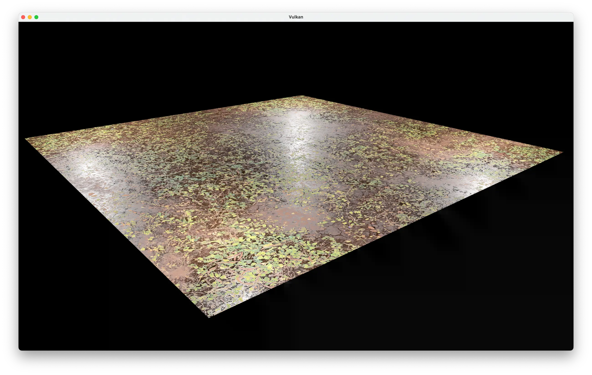
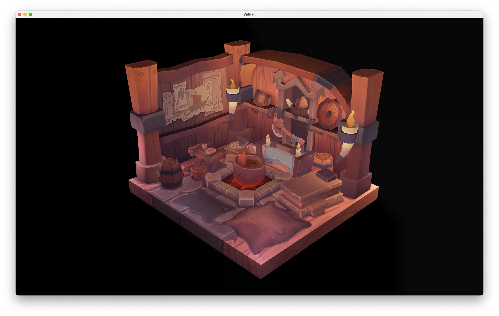

# Vulkan Tutorial

> A repo following along the awesome [Vulkan Tutorial](vulkan-tutorial.com) by Alexander Overvoorde ([@Overv](https://github.com/Overv)) + some small additions.

I followed every section of the tutorial and I've also continued past the tutorial a bit by adding (hardcoded) multi-texture support, PBR rendering (using [LearnOpenGL Tutorial's PBR shader](https://learnopengl.com/code_viewer_gh.php?code=src/6.pbr/1.1.lighting/1.1.pbr.fs)).

***Note**: there is some leftover code from my failed attempt to get tesselation working for the PBR scene.*

<p align="center">
    
    <br>
    Example of PBR rendering on a quad. 8k textures used: <a href="https://polyhaven.com/a/brown_mud_leaves_01">Brown Mud Leaves (CC0)</a>
    <br>
    <br>
    
    <br>
    8x MSAA rendering of <a href="https://vulkan-tutorial.com/Loading_models#sample-mesh">Tutorial's Sample Mesh + Texture</a>
</p>

## Dependencies

All used in the tutorial to focus on actual Vulkan-specific concepts + code.

- [VulkanSDK](https://vulkan.lunarg.com/sdk/home) - Vulkan Development SDK
- [glfw](https://github.com/raysan5/raylib/) - Multi-platform library for OpenGL (+ ES) and Vulkan, simplifying creating windows, contexts, surfaces and receiving inputs + events.
- [glm](https://github.com/raysan5/raylib/) - Graphics-Oriented Mathematics header-only library
- [stb_image](https://github.com/nothings/stb) - Single header-only image loading library
- [tinyobj](https://github.com/tinyobjloader/tinyobjloader) - Tiny but powerful single file wavefront obj loader

## Releases

> A Vulkan-supported (i)GPU with ~256mb or more vRAM is required!

There is a release for both [Windows (x64)](https://github.com/eilume/VulkanTutorial/releases/download/v1.0/win-x64-release.zip) + [Mac (Arm64/Apple Silicon)](https://github.com/eilume/VulkanTutorial/releases/download/v1.0/mac-arm64-release.zip) available with the assets (viking room + 4k PBR textures) bundled!

## Setup

> Note: This repo uses XCode but it should work in other IDEs/platforms as long as the build pipeline/script links the [dependencies above](#dependencies). Also a Vulkan-supported (i)GPU is required! 

1. Clone repo locally to disk.
```bash
$ git clone https://github.com/eilume/VulkanTutorial
```
2. Run `VulkanTutorial/shader_compile.sh` to generate `.spv` shader binaries.
```bash
$ cd VulkanTutorial
# you may need to add execute permissions to the script
$ chmod +x ./shader_compile.sh
$ ./shader_compile.sh
```
3. Install and open the XCode project `VulkanTutorial.xcodeproj`.
4. Download a single set of PBR textures at a resolution of your choosing (for some awesome free CC0 source: [PolyHeaven](https://polyhaven.com/textures), just make sure you have enough vRAM for the selected resolution!) and put them into `VulkanTexture/textures/pbr/` folder with the following names:
```
"textures/pbr/diff.png" - Albedo/Diffuse Texture
"textures/pbr/normal.png" - (OpenGL format) Normal Texture
"textures/pbr/metal.png" - Metallic Texture
"textures/pbr/rough.png" - Roughness Texture
"textures/pbr/ao.png" - Ambient Occlusion Texture
"textures/pbr/disp.png" - Displacement Texture (left-over tesselation requirement)
```
5. Build and run project either under **Debug** or **Release** target.

## Controls

### General

- `Esc` - **Quit** Application
- `Enter` - **Toggle** Solid/Wireframe Shading
- `1` - **Load** Viking Model Scene
- `2` - **Load** PBR Quad Scene (likely will take a couple seconds since it has to generate mipmaps)

### Camera

FPS-style controls with upward + downward movement and camera fov adjustment.

- `W` - **Forward** Camera Movement
- `A` - **Left-strafe** Camera Movement
- `S` - **Right-strafe** Camera Movement
- `D` - **Backward** Camera Movement
- `Q` - **Downward** Camera Movement
- `E` - **Upward** Camera Movement
- `Scrollwheel` - **Increase/Decrease** Camera Field of View (FOV)